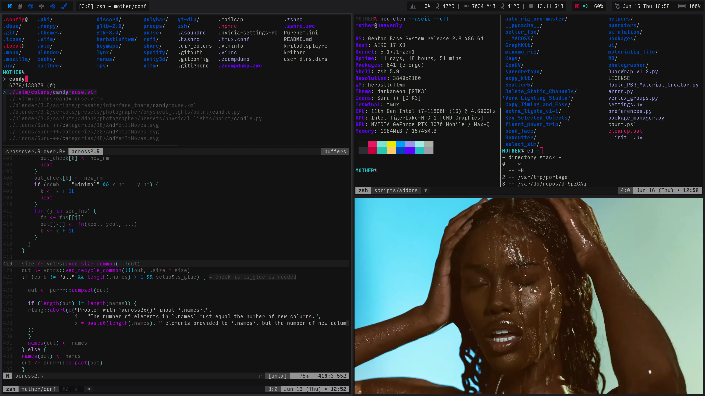
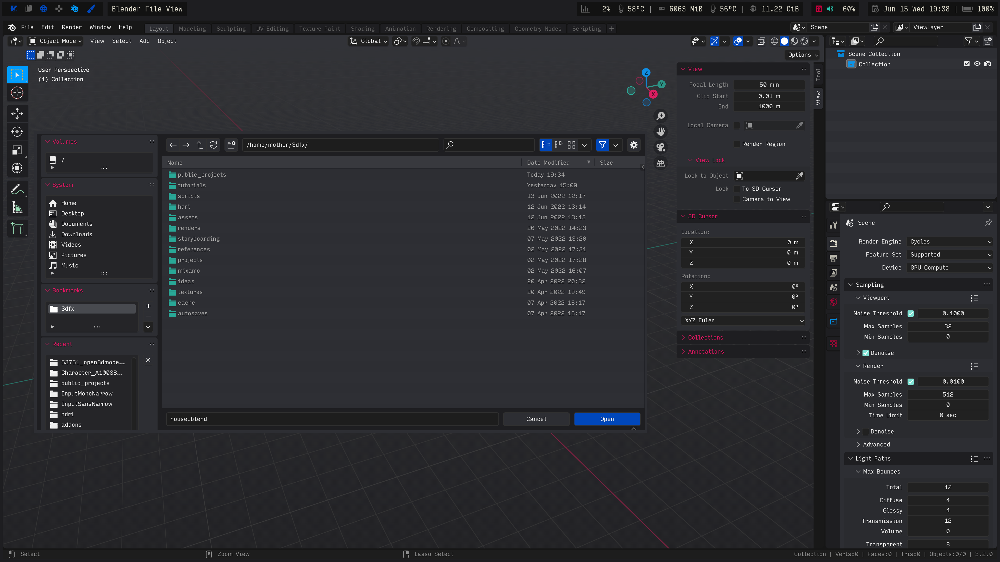

Current Setup:
--------------

+ *DEVICE* = Gigabyte Aero 17 HDR ( [link](https://www.gigabyte.com/Laptop/AERO-17-HDR--Intel-11th-Gen) )

+ *DISTRO* = Gentoo ( ~amd64 nomultilib ) ( [link](https://www.gentoo.org) )

+ *KERNEL* = GNU/Linux 6.3.9 ( [link](https://kernel.org) )

+ *SOURCES* = Zen ( [link](https://github.com/zen-kernel/zen-kernel) )

+ *INIT* = OpenRC ( [link](https://github.com/OpenRC/openrc) )

+ *UDEV* = mdevd ( [link](https://skarnet.org/software/mdevd/) ) + libudev-zero ( [link](https://github.com/illiliti/libudev-zero) )

+ *SHELL* = Zsh ( [link](https://www.zsh.org/) )

+ *EDITOR* = ViM ( [link](https://www.vim.org/) )

+ *TERMINAL MULTIPLEX* = Tmux ( [link](https://github.com/tmux/tmux/wiki) )

+ *TERMINAL EMULATOR* = st ( [link](https://st.suckless.org/) )

+ *WINDOW MANAGER* = herbstluftwm ( [link](https://herbstluftwm.org/) )

+ *IMAGE VIEWER* = pqiv ( [link](https://github.com/phillipberndt/pqiv) )

+ *MEDIA PLAYER* = mpv ( [link](https://mpv.io/) )

+ *DOCUMENT READER* = mupdf ( [link](https://mupdf.com/) )

+ *WEB BROWSER* = Firefox ( [link](https://www.mozilla.org/en-US/firefox/new/) ) + Surfingkeys ( [link](https://github.com/brookhong/Surfingkeys) )

Screenshots:
--------------

