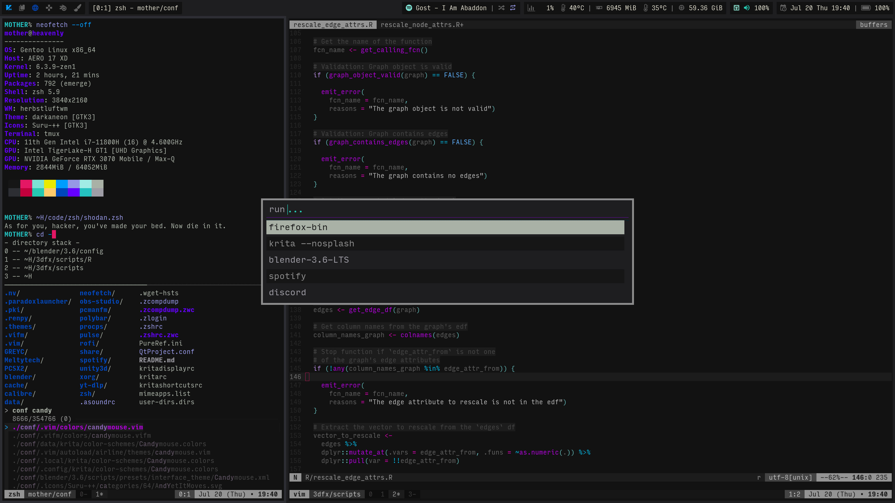

Current Setup:
--------------

+ *DISTRO* = Gentoo ( ~amd64 nomultilib ) ( [link](https://www.gentoo.org) )

+ *KERNEL* = GNU/Linux 6.6.8 ( [link](https://kernel.org) )

+ *SOURCES* = Zen ( [link](https://github.com/zen-kernel/zen-kernel) )

+ *INIT* = OpenRC ( [link](https://github.com/OpenRC/openrc) )

+ *UDEV* = mdevd ( [link](https://github.com/skarnet/mdevd) ) + libudev-zero ( [link](https://github.com/illiliti/libudev-zero) )

+ *SHELL* = Zsh ( [link](https://www.zsh.org/) )

+ *EDITOR* = Neovim ( [link](https://neovim.io/) )

+ *TERMINAL MULTIPLEX* = Tmux ( [link](https://github.com/tmux/tmux/wiki) )

+ *TERMINAL EMULATOR* = kitty ( [link](https://sw.kovidgoyal.net/kitty/) )

+ *WINDOW MANAGER* = herbstluftwm ( [link](https://herbstluftwm.org/) )

+ *IMAGE VIEWER* = sxiv ( [link](https://github.com/xyb3rt/sxiv) )

+ *MEDIA PLAYER* = mpv ( [link](https://mpv.io/) )

+ *DOCUMENT READER* = mupdf ( [link](https://mupdf.com/) )

+ *WEB BROWSER* = Firefox ( [link](https://www.mozilla.org/en-US/firefox/new/) )

Screenshots:
--------------

