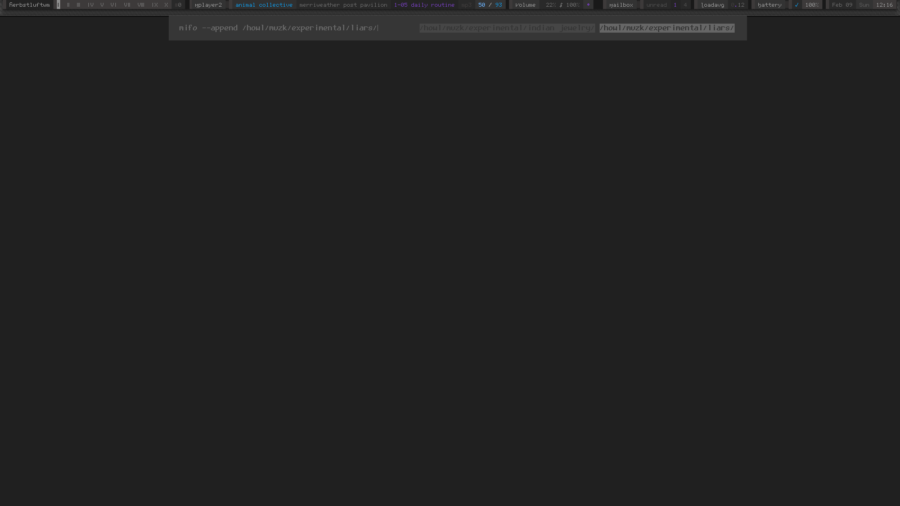
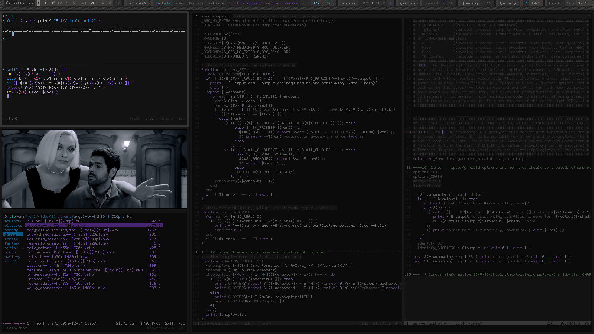
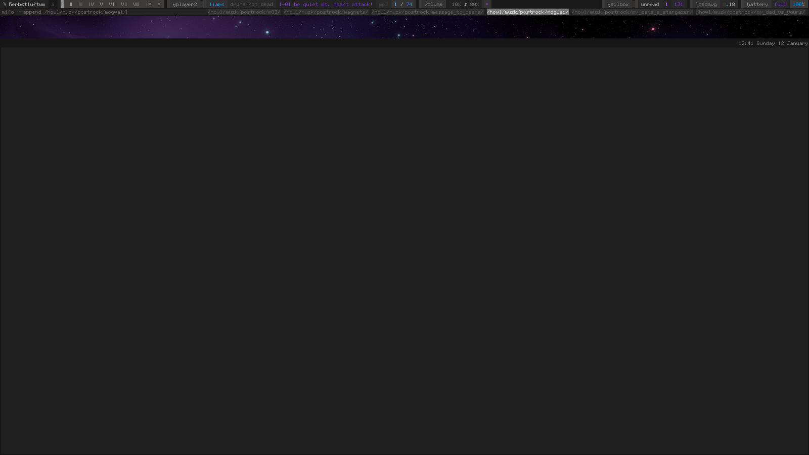
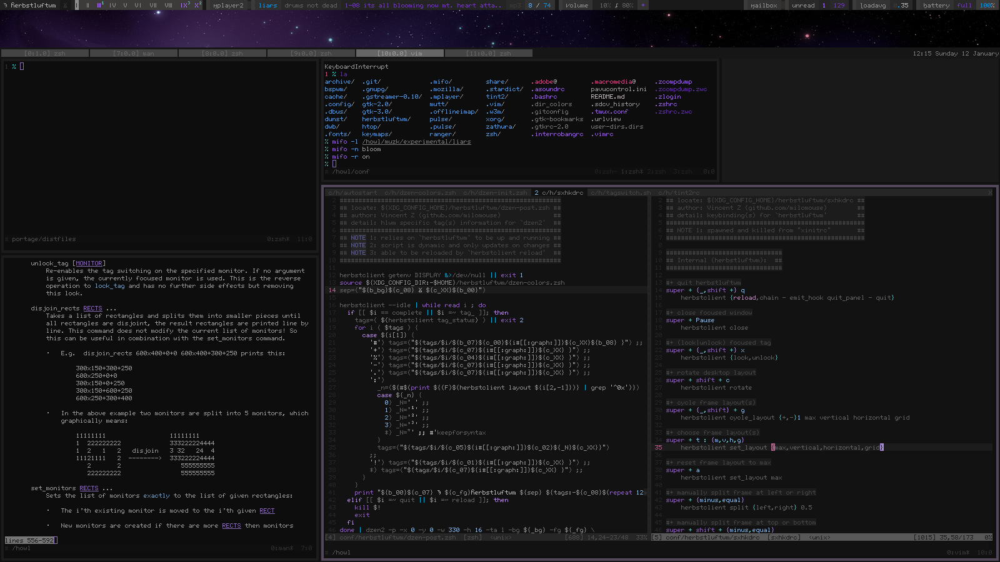

Current Setup:
--------------

+ *DISTRO* = Gentoo ( ~amd64 nomultilib )

+ *KERNEL* = GNU/Linux 3.10.27 ( RT_PREEMPT, loop-AES, GCC [K10] )

+ *SOURCES* = deadspace ( [ebuild](https://github.com/milomouse/ebuilds/tree/master/sys-kernel/deadspace-sources) )

+ *BUILD* = #1 SMP PREEMPT RT Sat Jan 18 18:22:09 EST 2014 x86_64 AMD

+ *INIT* = OpenRC

+ *UDEV* = eudev

+ *SHELL* = Zsh

+ *EDITOR* = ViM

+ *MAIL SENDER* = Postfix

+ *MAIL RECEIVER* = Postfix , OfflineIMAP

+ *MAIL FILTER* = notmuch

+ *MAIL READER* = Mutt

+ *AUDIO PLAYER* = mifo ( [ebuild](https://github.com/milomouse/ebuilds/tree/master/media-sound/mifo) , [code](https://github.com/milomouse/mifo) )

+ *VIDEO PLAYER* = MPlayer2

+ *WINDOW MANAGER* = herbstluftwm

+ *TERMINAL EMULATOR* = URxvt

+ *TERMINAL MULTIPLEX* = Tmux

+ *IMAGE VIEWER* = sxiv

+ *WEB BROWSER* = dwb

Screenshots:
--------------

Currently:

Previously:

